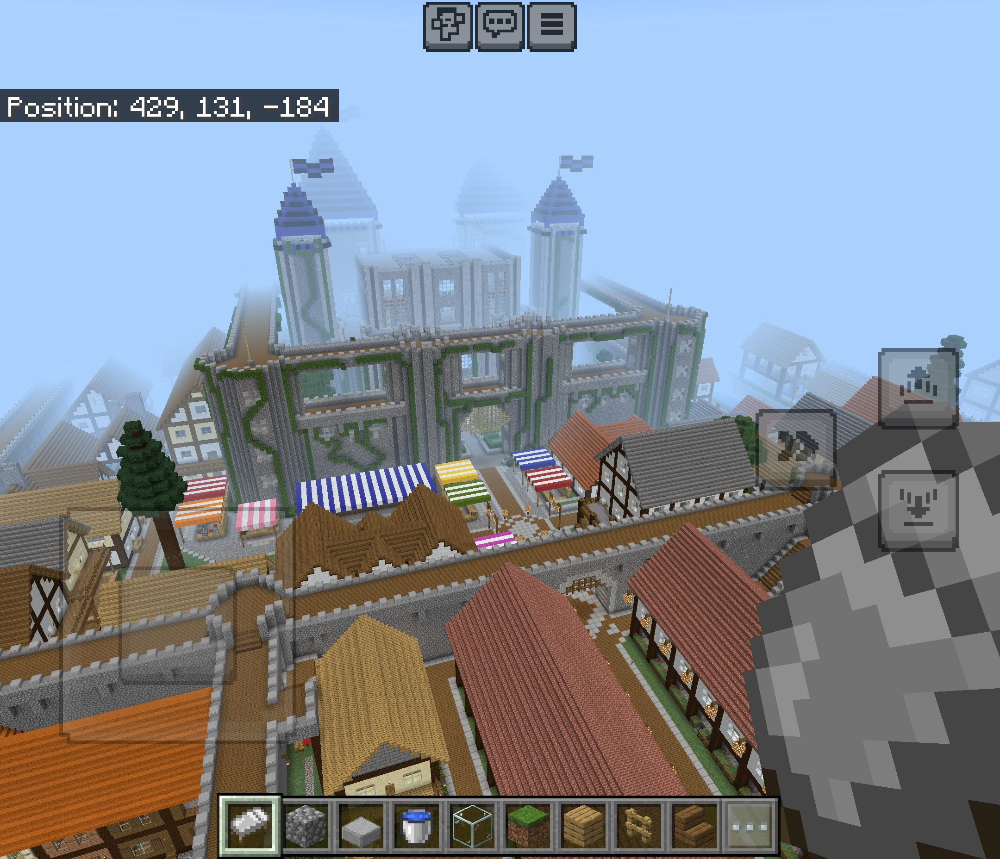

# 🎮 Minecraft Bedrock Server – Proxmox Homelab Project

## 📘 Project Overview
In this project, I architected and deployed a **Minecraft Bedrock Edition Server** hosted within a **Proxmox Virtual Environment**. The goal was to move away from the limitations of "Minecraft Realms" to create a high-performance, highly customizable multiplayer environment for family and friends.

This project served as a deep dive into **virtualization**, **Linux server administration**, and **edge networking**.

---

## 🧰 Hardware & Prerequisites
* **Host Machine:** HP/Compaq Elite (Intel i5 Quad-Core, 16GB RAM, 128GB SSD)
* **Hypervisor:** **Proxmox VE**
* **Guest OS:** **Ubuntu Server** (Headless)
* **Network:** Router supporting **Port Forwarding**, **DHCP Reservations**, and **Dynamic DNS (DDNS)**.

  
  

---

## 🛠️ Technologies & Skills
* **Virtualization:** Deploying and managing VMs in Proxmox.
* **Linux Admin:** Command Line Interface (CLI), SSH, and file permissions.
* **Networking:** NAT, Port Forwarding (**UDP 19132**), and DDNS configuration.
* **Optimization:** Resource allocation (CPU/RAM balancing) and latency tuning.

---

## 🪜 Implementation Steps

### 1. Virtual Machine Provisioning
I deployed an **Ubuntu Server** instance on Proxmox, carefully balancing resources to ensure stability. 
* **Specs:** 2 Cores, 4GB RAM, and 10GB storage.

### 2. Server Configuration
* Installed official Bedrock server binaries.
* Hardened the server by configuring `server.properties` for whitelisting and operator (OP) permissions.
* Managed the server environment via **SSH**.

### 3. Network & Connectivity
To ensure the server was accessible globally without a static IP, I implemented:
* **DHCP Reservation:** Locked the VM to a specific internal IP.
* **Port Forwarding:** Opened **UDP 19132** to allow external traffic.
* **Dynamic DNS (DDNS):** Integrated a hostname provider to automatically track WAN IP changes.

---

## ⚠️ Challenges & Troubleshooting

### **The Port Forwarding "Ghost"**
* **Issue:** External connections were failing despite the rule being active.
* **Fix:** Discovered the router's "External IP" field in the port-forwarding rule was too restrictive. By leaving it blank, the router successfully accepted traffic from any source IP.

### **WAN IP Instability**
* **Issue:** Every router reboot broke the connection for external players.
* **Fix:** Implemented **Dynamic DNS (DDNS)**, allowing users to connect via a persistent hostname (e.g., `brandon.ddns.net`) rather than a

